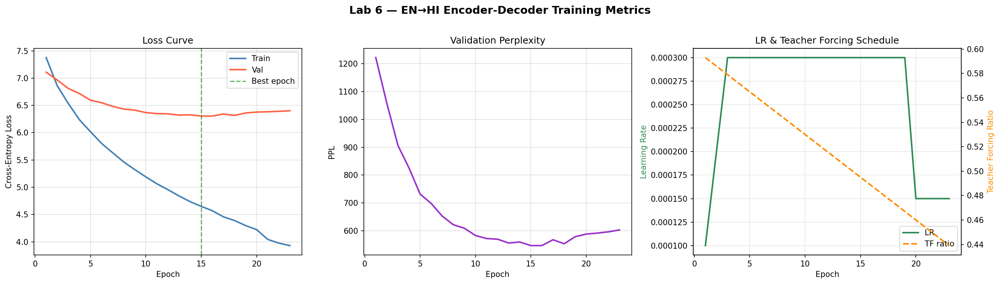
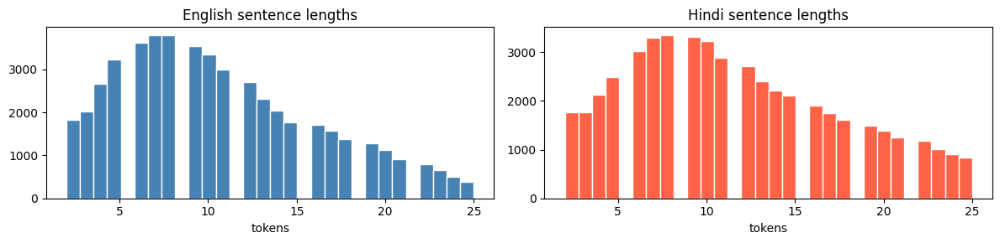
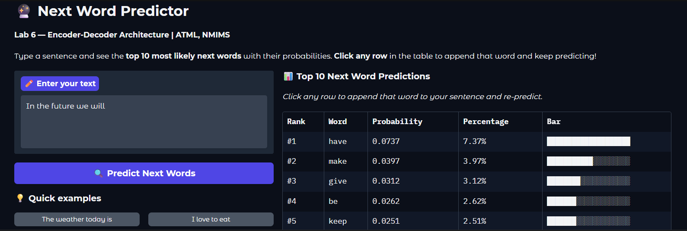
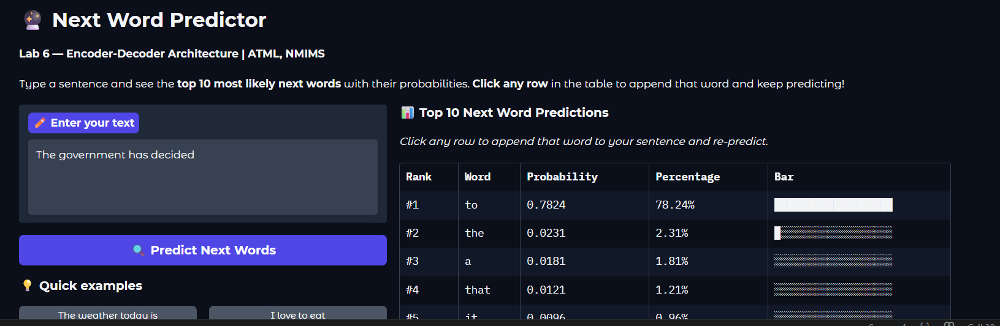
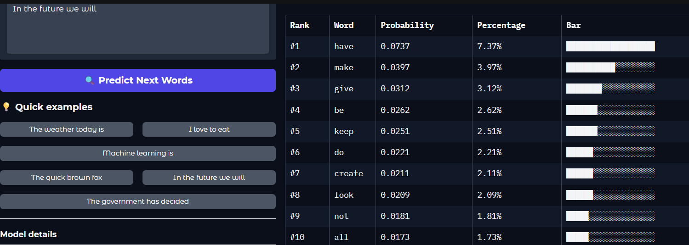
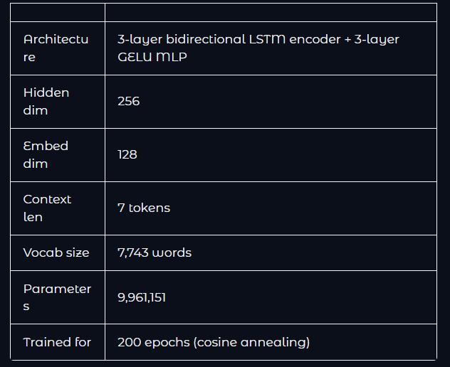

# 🚀 ATML Lab 6 — Encoder-Decoder Architecture

## 📌 Overview

This project implements an **Encoder-Decoder (Seq2Seq) architecture using LSTM** for:

* English → Hindi Machine Translation
* English → Spanish Machine Translation
* Next Word Prediction
* Interactive Gradio UI

---

## 🧠 Model Architecture

* Encoder: Multi-layer LSTM
* Decoder: Multi-layer LSTM
* Teacher Forcing
* Gradient Clipping

---

## ⚙️ Hyperparameters

| Parameter     | Value |
| ------------- | ----- |
| Embedding Dim | 256   |
| Hidden Dim    | 512   |
| Layers        | 2     |
| Batch Size    | 64    |
| Epochs        | 30    |

---

## 📊 Results

### 🔹 Training Curve

### 🔹 Translation Output

---

## 🖥️ Gradio UI — Next Word Predictor

### 🔹 UI Example 1

### 🔹 UI Example 2

### 🔹 UI Example 3

### 🔹 UI Example 4

---

## 🌍 Tasks Implemented

* English → Hindi Translation
* BLEU Score Evaluation
* English → Spanish Translation
* Next Word Predictor

---

## 🖥️ How to Run

1. Open notebook in Google Colab
2. Enable GPU (T4)
3. Run all cells
4. Launch Gradio

---

## 👨‍💻 Author

* Jaden Castelino
* NMIMS Mumbai
